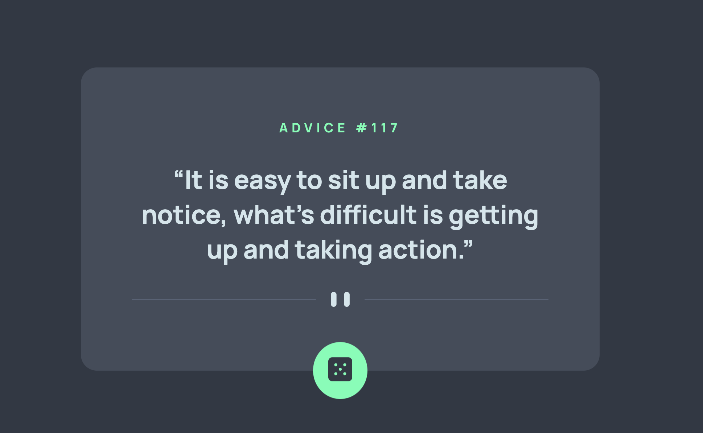

# Frontend Mentor - Advice generator app solution

This is a solution to the [Advice generator app challenge on Frontend Mentor](https://www.frontendmentor.io/challenges/advice-generator-app-QdUG-13db). Frontend Mentor challenges help you improve your coding skills by building realistic projects.

## Table of contents

- [Overview](#overview)
  - [The challenge](#the-challenge)
  - [Screenshot](#screenshot)
  - [Links](#links)
- [My process](#my-process)
  - [Built with](#built-with)
  - [What I learned](#what-i-learned)
- [Author](#author)

**Note: Delete this note and update the table of contents based on what sections you keep.**

## Overview

### The challenge

Users should be able to:

- View the optimal layout for the app depending on their device's screen size
- See hover states for all interactive elements on the page
- Generate a new piece of advice by clicking the dice icon

### Screenshot

### Links

- Live Site URL: [Check it here!](https://timely-entremet-3ca82c.netlify.app/)

## My process

### Built with

- Semantic HTML5 markup
- SASS
- Flexbox
- Vanilla Javascript
- Destructuring ES6 Methods
- DOM Manipulation
- API`s

### What I learned

This project was a good example to work with Third party API and manipulating the DOM using Vanilla JS.

### Continued development

I add some animations, such as:

- Bouncing animation on the dice button
- Rotation on the dice image whenever a client fetch a new quote for the App
- Fade in animation on the text whenever a client fetch a new quote

## Author

- Frontend Mentor - [@lhpellizzon](https://www.frontendmentor.io/profile/lhpellizzon)
